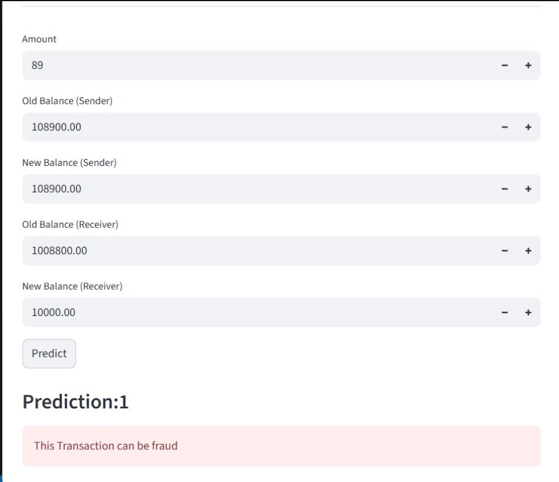

## Fraud Detection Streamlit App
A machine learning web application built with Streamlit to detect fraudulent financial transactions. The app uses a Logistic Regression model trained on transaction features such as amount, sender balance, and receiver balance to predict whether a transaction is fraudulent (1) or legitimate (0).
### 📌 Features

- Interactive Streamlit UI for user input.

- Predicts if a transaction is likely to be fraudulent.

- Displays fraud probability and binary classification result.

- Modular project structure with separate training and deployment scripts.

- Reproducible ML pipeline with scikit-learn.

ML-Fraud-Detection/
│
├── src/
│   ├── app.py               # Streamlit app (frontend)
│   ├── train.py             # Script to train and save model
│   ├── pipeline.py          # ML pipeline (preprocessing + model)
│   ├── utils.py             # Helper functions
│
├── notebooks/
│   └── analysis-modeling.ipynb   # Exploratory analysis & experiments
│
├── datasets/
│   └── sample.csv           # Example dataset (small sample)
│
├── models/
│   └── fraud_detection.pkl  # Trained ML model
│
├── requirements.txt         # Python dependencies
├── README.md                # Project documentation
└── .gitignore               # Ignore venv, __pycache__, large data

## Installation

### Clone Repo
git clone https://github.com/your-username/ML-Fraud-Detection.git
cd ML-Fraud-Detection

### Create Virtual Environment
python -m venv .venv
.venv\Scripts\activate   # Windows
source .venv/bin/activate # Mac/Linux

### Install Dependencies
pip install -r requirements.txt

### Run App
streamlit run src/app.py

### Usage
 ##### Enter Transaction Details
 - Amount
 - Old Balance (Sender)
 - New Balance (Sender)
 - Old Balance (Receiver)
 - New Balance (Receiver)
 
 ##### Click Predict
 
 ### App will display whether the Transaction is Fraud or Not

 # Model Used
 - Logistic Regression
 - Imbalanced Class Handling (SMOTE)

 ## Deployed on streamlit

 ## Demo Screenshot
 
